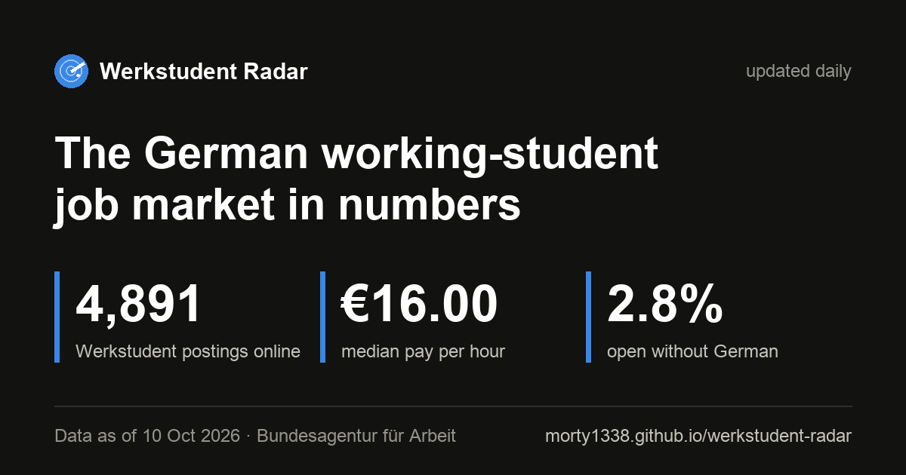

# Werkstudent Radar

[](https://github.com/morty1338/werkstudent-radar/actions/workflows/daily.yml)
[](https://github.com/morty1338/werkstudent-radar/actions/workflows/tests.yml)

[](https://morty1338.github.io/werkstudent-radar/)

The German working-student job market in numbers: real hourly rates, which
skills are in demand, and how many jobs you can get without speaking German.

Only Werkstudent postings in Germany are collected, from two sources:

- the public job search of the [Bundesagentur für Arbeit](https://www.arbeitsagentur.de/jobsuche/), and
- companies' own career sites (Personio, Greenhouse, Lever, …) through the free
  [Arbeitnow](https://www.arbeitnow.com/) job API. This adds many start-ups that
  never post on the Bundesagentur's board. A posting on both counts once.

LinkedIn, StepStone and Indeed forbid automated collection (terms of use,
`robots.txt`, EU database rights), so they aren't used; most of their postings
are copied from the same company career sites.

**Live: [morty1338.github.io/werkstudent-radar](https://morty1338.github.io/werkstudent-radar/)**, updated every morning.

The page answers one question per section, and every chart is a filter: click
Berlin on the map or "IT & Software" in a chart and the whole page follows.

1. **Where are the jobs?** A map of ~900 places (Germany's outline appears from
   the postings alone) and the job fields.
2. **What does it pay?** The hourly pay distribution and the typical range per
   field or city.
3. **Which skills are asked for?** The most requested skills by group; click one
   for its pay, where it's used, and its jobs.
4. **What does your degree lead to?** Wirtschaftsinformatik, Informatik, BWL,
   Wirtschaftsingenieurwesen and more.
5. **How is it changing?** Daily snapshots from 9 Oct 2026 on.
6. **Check your skills.** Tick skills, or upload a CV (PDF, DOCX or TXT) and its
   skills are ticked for you, to see the share of jobs you qualify for, what to
   learn next and the matching postings. The CV is analysed in the browser with
   the same skill dictionary as the postings and is never uploaded.

## Quick start

```bash
python3 -m venv .venv
.venv/bin/pip install -r requirements.txt
.venv/bin/python -m radar.collect   # 1. raw search results (~30 s)
.venv/bin/python -m radar.arbeitnow # 1b. company career sites (a few minutes, paced)
.venv/bin/python -m radar.enrich    # 2. job texts -> features in data/jobs.csv (~2 min on the first run)
.venv/bin/python -m radar.history   # 3. today's scan -> data/history/*.csv, data/history.sqlite
.venv/bin/python -m radar.checks    #    data-quality checks (exit code 1 if one fails)
.venv/bin/python -m radar.build     # 4. SQL aggregates -> docs/data/*.json + data/history.csv
```

`collect` pages through the job search API for all Werkstudent postings in Germany
and writes them to `data/raw/<date>/`:

| File | Content |
|------|---------|
| `listings.jsonl.gz` | one raw search result per line, de-duplicated by reference number |
| `run.json` | run metadata: endpoint, results per query, counts, duration |

`enrich` fetches the full text only for postings that are new (or were tagged
by an older rule version), caches it locally in `details.jsonl.gz` and turns
it into features. Raw data stays local (`data/raw/` is git-ignored). Job
descriptions belong to the employers and are never published: `data/jobs.csv`
holds only derived features plus the reference number, which links to the
original posting at `https://www.arbeitsagentur.de/jobsuche/jobdetail/<refnr>`.

## `data/jobs.csv`

One row per Werkstudent posting ever seen.

| Column | Meaning |
|--------|---------|
| `refnr`, `title`, `company`, `hauptberuf` | posting metadata from the API |
| `city`, `region`, `lat`, `lon` | first location: city name normalised, coordinates for the map |
| `category` | job field from title / occupation (`it`, `data`, `marketing`, `finance`, `engineering`, `retail`, …) |
| `lang` | language the posting is written in (`de` / `en`) |
| `german` | `required` (e.g. "fließend Deutsch", "German C1"), `plus` ("von Vorteil", "nice to have"), `none` ("English only", or an English posting that never asks for German), `implicit` (German posting that doesn't mention it) |
| `english` | 1 if English is required |
| `pay_min`, `pay_max`, `pay_src` | hourly pay in € from the API's salary fields (`ba`) or the text (`text`, e.g. "17,50 € brutto pro Stunde") |
| `hours` | hours per week, if stated |
| `skills` | skill ids from [`radar/skills.py`](radar/skills.py), `\|`-separated |
| `majors` | study programmes mentioned (`wiinf`, `inf`, `bwl`, `wiing`, …) |
| `remote`, `external` | home office possible; posting links to an external site |
| `published`, `first_seen`, `last_seen` | first publication date; first/last day the collector saw it |
| `detail_ok`, `xv` | text was available; extractor version used |
| `source`, `url` | `ba` or `arbeitnow`; link to the original (empty for `ba`, which links via `refnr`) |

### How features are extracted

- **Skills**: a dictionary of ~180 skills with German and English synonyms
  (`SQL`, `Power BI`, `SAP FI/CO`, `Buchhaltung`/`accounting`, …). Words that
  are also common language ("Excel" vs. "excel at", "React" vs. "react to")
  are matched case-sensitively. Broad domain terms ("Einkauf", "Vertrieb",
  "Recruiting") only count next to a requirement cue like "Kenntnisse",
  "Erfahrung" or "experience", so benefits such as "5% Einkaufsrabatt" or an
  "Recruiting-Team" contact line don't count.
- **German**: regex rules for requirement phrases, scoped to the list item they
  appear in, so in "Sehr gute Deutschkenntnisse, Englisch von Vorteil" the
  "von Vorteil" is attributed to English.
- **Pay**: an amount only counts as hourly pay when the marker sits right next
  to it ("16 €/h", "Stundenlohn von 16 €"), and only between 12 and 60 €.

## Aggregation (`radar/build.py`, `radar/sql/`)

`build` loads `jobs.csv` into an in-memory SQLite database
([schema](radar/sql/schema.sql): `jobs`, link tables `job_skills` /
`job_majors`, label tables) and runs one SQL file per output. Medians and
quartiles come from a custom `percentile(value, q)` aggregate, their confidence
intervals from a `median_ci(value, bound)` aggregate; top-N per group uses
window functions. The statistics live in [`radar/stats.py`](radar/stats.py).

Three choices keep the numbers honest:

- **Pay counts each role once.** Some employers post the same role in dozens of
  cities (one had 97 copies, all at minimum wage). Pay figures use one posting
  per company + title (per city for city figures); job counts still count every
  posting.
- **Medians need breadth.** A median is shown only with at least 10 roles from 5
  employers. Each group also reports `pay_employers` and `top_employer_share`;
  headline comparisons ("best-paid city") skip groups where one employer supplies
  more than 35% of the sample.
- **Medians come with their uncertainty.** Every median pay has a 95% confidence
  interval from a percentile bootstrap (2,000 resamples with replacement, fixed
  seed, so the same data gives the same interval). A median whose interval is
  wider than a quarter of its value (e.g. €13.50–18.50 around €16) is hidden like
  one with too few roles. The site computes the same intervals in the browser for
  whatever the filters select ([`stats.js`](docs/assets/stats.js); a test checks it
  against Python).

Two more analyses:

- **How long postings stay online** (`lifetimes.json`): a Kaplan–Meier curve of
  the share of Bundesagentur postings still online by days since publication.
  Postings are only observed from their first scan, so the estimate uses
  delayed entry (a posting published 40 days before the first scan only counts
  from day 40); postings still online are censored. The curve stops where fewer
  than 30 postings are observed, and has a 95% band from Greenwood's formula.
  It sharpens with every day of history.
- **Skills asked for together** (`cooccurrence.json`, SQL self-join in
  [`cooccurrence.sql`](radar/sql/cooccurrence.sql)): for each skill, the skills
  with the highest lift, P(A and B) / (P(A)·P(B)), among pairs in at least 5
  postings. Lift 3 means three times as often together as if they were unrelated.

Outputs:

| File | Content |
|------|---------|
| `docs/data/summary.json` | totals, German requirements, pay histogram, fields, cities, skills, study programmes (with example postings), all postings open to non-German speakers, headline insights |
| `docs/data/checker.json` | per posting: field, city, German level, pay, skills, role and employer ids. The site filters and aggregates these in the browser, so every chart reacts to the filters |
| `docs/data/postings.json` | title, company, city and date for the same postings in the same order; loaded when the job list comes into view |
| `docs/data/patterns.json` | the skill and study-programme rules converted for JavaScript, for analysing a CV in the browser (a test checks that Python and JavaScript find the same skills) |
| `docs/data/history.json` | daily series built from `data/history.csv` (median pay with its 95% CI) |
| `docs/data/lifetimes.json` | Kaplan–Meier curve of postings still online by days since publication, median days online overall and by field |
| `docs/data/cooccurrence.json` | per skill, the skills most often asked for together, with lift and share |
| `docs/data/og.png` | link preview image with today's numbers (shown by Telegram, WhatsApp, LinkedIn; also at the top of this README) |
| `data/history.csv` | one row per day × metric (`total`, `category`, `city`, `skill`, `major`, `german`). Which postings were online on a given day can't be reconstructed later, so this is collected from day one. |

## Posting history (`radar/history.py`)

`data/jobs.csv` keeps every posting ever seen with its `first_seen` and
`last_seen`. The history step adds *when* each posting was online, so gaps,
inflow and outflow can be analysed later. It keeps two small text tables in
`data/history/` (committed) and rebuilds a SQLite database from them:

| File | Content |
|------|---------|
| `data/history/scans.csv` | one row per collection day and source: postings online |
| `data/history/online.csv` | stretches of consecutive scans a posting was online in (`refnr, start_date, end_date`); `end_date` stays empty while it is online, so a row only changes when a posting appears or disappears |
| `data/history.sqlite` | `scans`, `online`, `postings` (field, city, coordinates, pay, German requirement, first/last seen; no texts), `posting_skills` and a `lifetimes` view. Git-ignored: `python -m radar.history` rebuilds it in a few seconds |
| `docs/data/timeline.json` | per day: postings online, new, back after a gap, gone; online per source |

Why not commit the SQLite file itself: every day thousands of `last_seen`
values change, which touches most pages of the database file, and git would
store a new multi-megabyte copy each day. The text tables change by a few
hundred lines a day.

A posting missing from a scan ends its stretch at the scan before; if it comes
back it starts a new one. A day without a scan (a skipped run) isn't a gap.
History before this step existed was backfilled from `jobs.csv` (one stretch
from `first_seen` to `last_seen` per posting) and checked against the daily
totals in `data/history.csv`.

```sql
-- e.g. in sqlite3 data/history.sqlite
SELECT field, COUNT(*) AS gone, AVG(days_seen) AS avg_days
FROM lifetimes WHERE NOT still_online GROUP BY field ORDER BY gone DESC;
```

## Automation

[`daily.yml`](.github/workflows/daily.yml) runs every morning (04:23 UTC) and
can be started by hand from the Actions tab. GitHub doesn't guarantee scheduled
runs, so a catch-up run at 16:23 UTC does the work only if the morning one
didn't happen (it checks `data/history.csv` for today's date):

1. `collect` → `arbeitnow` → `enrich` → `history` → `checks` → `build`. Only new postings need their
   text, so a normal day takes a few minutes. If the Arbeitnow step fails, the
   day goes on with the Bundesagentur's data and recently seen career-site
   postings are kept.
2. Commits `data/jobs.csv`, `data/history.csv`, `data/history/` and `docs/data/` as
   `github-actions[bot]` ("Update data for YYYY-MM-DD").
3. If any step fails, opens an issue "Daily data update failed" with the last
   40 log lines and a link to the run (GitHub notifies by e-mail). Further
   failures comment on the same issue; the next successful run closes it.

The run fails on purpose when the data looks wrong, before anything is
committed:

| Where | Fails when |
|-------|-----------|
| `collect` | an API path answers 403/404 (old versions get switched off), fewer than 1,000 postings, or fewer than half of the previous day's |
| `enrich` | more than half of the newly fetched job texts come back empty |
| `checks` (volume) | today's Bundesagentur postings are more than 50% below or above the median of the previous 7 scans (for Arbeitnow, an optional source, only a warning) |
| `checks` (fields) | a raw listing has no reference number, or title, employer, place or publication date are missing in more than 2% of listings (an API field was renamed) |
| `checks` (pay) | an hourly rate of today's postings is outside 12–60 €/h, or its minimum is above its maximum |

`checks` also writes its results as a table into the run's summary page.

[`pages.yml`](.github/workflows/pages.yml) publishes `docs/` to GitHub Pages.
It runs on pushes that change the site and is called by the daily workflow
after each data update, because commits pushed with `GITHUB_TOKEN` don't
trigger Pages builds on their own.

[`tests.yml`](.github/workflows/tests.yml) runs the test suite on every push
and pull request (badge at the top).

## Website (`docs/`)

A static page in plain HTML, CSS and JavaScript (no framework, no build step),
so it loads instantly and costs nothing to host. Charts are hand-made HTML/SVG
in a dark "radar" theme. The only third-party code is pdf.js, loaded from
cdnjs only when someone uploads a PDF. GitHub Pages lets browsers cache files
for 10 minutes, so the deploy stamps its commit into the asset URLs
(`?v=dev` → `?v=<commit>`); otherwise a browser can mix old and new scripts.

- **Skill gap.** In "Check your skills" the page suggests what to learn next:
  "Learn SQL and Power BI to qualify for 48 more jobs". It is greedy by marginal
  gain ([`gap.js`](docs/assets/gap.js)): each step adds the skill that makes the
  most postings fit on top of your skills and the ones picked before, using the
  same fit rule as the match (you may lack one in four of a posting's skills).
  Computed in the browser from `checker.json`, so it follows the filters.
- **RSS feeds** ([`radar/feeds.py`](radar/feeds.py)): `docs/feeds/all.xml` and one
  feed per field (`it.xml`, `marketing.xml`, …) with postings new on the market in
  the last 7 days: first seen in that window, not on a source's first collection
  day, and published at most 7 days before. Items carry title, employer, city,
  pay, field and the link to the original posting, never the job text. Feed URLs
  have no version suffix so subscriptions keep working. Linked from the page
  ("Subscribe to new jobs") and announced with `<link rel="alternate">`.

To preview locally:

```bash
python3 -m http.server --directory docs
```

## Accuracy

The extraction rules are heuristics, so they are measured against 100 labelled
postings ([`radar/evaluate.py`](radar/evaluate.py)): 70 drawn at random, 20 that
the rules call "open without German" and 10 whose pay was found in the text.
Labelling was blind (posting text only, no predictions) and was done by an AI
assistant in two passes, not by a human; see
[`data/eval/LABELS.md`](data/eval/LABELS.md) for exactly how.

| Check | Baseline (rules v2) | After fixes (v3)\* |
|---|---|---|
| Needs German: yes / no (random 70) | 100% | 100% |
| German level: required / plus / none / not mentioned | 94% | 99% |
| Shown as "open without German" and really is | **68%** (15/22) | 100% (15/15) |
| Hourly pay found: precision / recall | 100% / 100% | 100% / 100% |
| Pay amount correct | 95% (18/19) | 100% (19/19) |
| Skills, 14 common ones: precision / recall | 99% / 96% | 99% / 97% |
| Job field | 64% | 79% |

\* The rules were fixed using the baseline disagreements, so the v3 column is
measured on postings the rules have now "seen" and is optimistic. The baseline
column is the honest one. Biggest lesson: the German rule confused "Russisch
von Vorteil" or "French is beneficial" with German being optional, which
inflated the share of English-friendly jobs. Job field remains the weakest
part: many postings sit between two fields ("Datenanalyse & Finance
Operations").

Full reports: [baseline](data/eval/report_baseline.md),
[current](data/eval/report.md). Every fixed error became a test case:

```bash
.venv/bin/pip install -r requirements-dev.txt
.venv/bin/python -m pytest                   # 109 rule and SQL tests
.venv/bin/python -m radar.evaluate report    # needs the local sample texts
```

## Project layout

```
radar/api.py       small client for the BA job search API (retries, errors)
radar/collect.py   fetch all Werkstudent postings -> data/raw/<date>/
radar/arbeitnow.py second source: company career sites via the Arbeitnow API
radar/enrich.py    fetch texts for new postings, extract features -> data/jobs.csv
radar/extract.py   feature extraction rules
radar/skills.py    skill dictionary (German + English synonyms)
radar/history.py   online stretches per posting -> data/history/, history.sqlite, timeline.json
radar/checks.py    data-quality checks of the daily run (volume, API fields, pay range)
radar/build.py     load jobs.csv into SQLite, run radar/sql/*.sql, write JSON
radar/stats.py     bootstrap CIs for medians, Kaplan–Meier with delayed entry
radar/feeds.py     RSS feeds of new postings -> docs/feeds/
radar/og_image.py  link preview image with today's numbers
radar/patterns.py  skill rules exported for the browser (CV analysis)
radar/sql/         schema and one query per output
radar/evaluate.py  accuracy check against labelled postings
eval/label.html    blind labelling form
tests/             rule tests on made-up snippets, SQL tests on a tiny fixture
data/jobs.csv      extracted features (committed)
data/history.csv   daily metric snapshots (committed)
data/history/      scans and online stretches per posting (committed; source of history.sqlite)
data/eval/         evaluation labels and reports (job texts stay local)
docs/              the website: index.html, assets/app.js (filters, charts),
                   match.js (skills check and job list), cv.js (CV reading), charts.js
docs/data/         JSON consumed by the website
docs/feeds/        RSS feeds (all and per field), rebuilt daily
data/raw/          local raw dumps, one folder per day (not committed)
```
